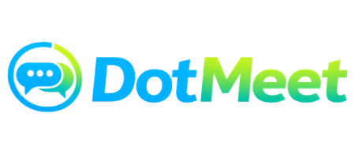

<p align="center">
  
</p>

<!-- <h1 align="center">Dotneet</h1> -->

<p align="center">
  AI-Powered Appointment Booking & Customer Support Platform
</p>

---

## 📖 Overview

DotMeet is an AI-powered appointment booking platform built for professionals and service providers - **doctors, teachers, lawyers, dentists, tutors, freelancers, consultants,** and other appointment-based businesses.

It combines a full appointment management system with an **AI assistant** that answers customer questions using business-specific information, guides customers through booking, and maintains context across long-running conversations.

---

## 🌐 Live Links

| Resource                | Link                                                     |
| ------------------------ | --------------------------------------------------------- |
| **Frontend**              | [Visit DotMeet](YOUR_LIVE_WEBSITE_URL)                   |
| **Backend**          | [API Documentation](YOUR_BACKEND_API_URL)                |
| **Frontend Repository**  | [DotMeet Frontend](YOUR_FRONTEND_REPOSITORY_URL)          |
| **Backend Repository**   | [DotMeet Backend](YOUR_BACKEND_REPOSITORY_URL)             |

> Replace the placeholder URLs above with the actual DotMeet deployment and GitHub repository links.

---

## ✨ Features

### 📅 Appointment Management
- Create and manage appointments
- Manage available schedules
- Customer-facing appointment booking
- Appointment status tracking
- Business-specific booking workflows

### 🤖 AI Assistant
- AI-powered customer support
- Answers questions using business information
- Assists customers through the booking process
- Maintains conversation context across sessions
- Supports long-running conversations
- Uses customer memory for personalized interactions

### 💬 Smart Conversation Management
DotMeet automatically manages long conversations to reduce AI token usage and improve response performance. When a conversation grows large, the system summarizes older messages and retains only the most relevant recent context.

### 🏢 Business Information
Each business can supply information the AI assistant draws on when talking to customers:
- Business description
- Services
- Pricing
- Working hours
- Appointment rules
- Frequently asked questions
- Other business-specific details

### ⚡ Performance & Scalability
- Optimized AI context management
- Reduced token usage
- Faster AI responses
- MongoDB-based conversation storage
- Scalable backend architecture

---

## 🧠 AI Conversation Summarization

To prevent long conversations from consuming excessive AI tokens, DotMeet automatically summarizes older conversation history.

### When Summarization Happens

Once a conversation passes roughly **20–30 messages**:

```
Customer Conversation
        ↓
20–30+ Messages
        ↓
Detect Long Conversation
        ↓
Send Older Messages to OpenRouter
        ↓
Generate Conversation Summary
        ↓
Save Summary to MongoDB
        ↓
Archive / Remove Older Messages
        ↓
Keep Latest 8–10 Messages
```

This lets the AI retain important context without resending the full conversation history on every request.

---

## 🗂️ Conversation Structure

Each conversation record stores:

```
Conversation
├── ownerId
├── customerId
├── sessionId
├── currentStep
├── summary
├── lastMessages
├── totalMessages
├── lastSummarizedAt
└── updatedAt
```

### Example Summary

```
The customer first asked about available appointment times.
The AI collected the customer's email, discussed pricing,
and the customer preferred afternoon appointments.

The current booking process is waiting for time confirmation.
```

---

## 🔄 AI Context Pipeline

Rather than sending the full conversation history to the AI, DotMeet assembles only the most relevant context for each request:

```
Business Summary
       ↓
Conversation Summary
       ↓
Current State
       ↓
Customer Memory
       ↓
Recent 8–10 Messages
       ↓
Latest User Message
       ↓
   OpenRouter
       ↓
  AI Response
```

### Context Components
1. Business Summary
2. Conversation Summary
3. Current Conversation State
4. Customer Memory
5. Last 8–10 Messages
6. Latest User Message

This keeps conversations coherent without repeatedly reprocessing unnecessary history.

---

## 🚀 Benefits

- **70–90% lower conversation context token usage**
- Faster AI responses
- Lower OpenRouter costs
- Better long-conversation performance
- Preserves important conversation context
- Improved scalability
- More efficient MongoDB storage

> Actual token savings vary with conversation length and summary size.

---

## 🏗️ System Architecture

```
                    ┌──────────────────┐
                    │     Customer     │
                    └────────┬─────────┘
                             │
                             ↓
                    ┌──────────────────┐
                    │  DotMeet Web App │
                    └────────┬─────────┘
                             │
                             ↓
                    ┌──────────────────┐
                    │   Backend API    │
                    └───────┬───┬──────┘
                            │   │
                ┌───────────┘   └────────────┐
                ↓                            ↓
        ┌───────────────┐            ┌───────────────┐
        │    MongoDB    │            │   OpenRouter  │
        │               │            │      AI       │
        └───────────────┘            └───────────────┘
                │                            │
                └────────────┬───────────────┘
                             ↓
                    ┌──────────────────┐
                    │   AI Assistant   │
                    └──────────────────┘
```

---

## 🔧 Tech Stack

**Frontend**
- Next.js
- React
- TypeScript
- Tailwind CSS
- Shadcn UI
- Redux / State Management
- REST API Integration

**Backend**
- Node.js
- Express.js
- TypeScript
- MongoDB
- Mongoose
- REST API
- Authentication & Authorization

**AI**
- OpenRouter
- LLM-based customer assistant
- Conversation summarization
- Business-context-aware responses
- Customer memory

**Deployment**
- Vercel — Frontend
- Render / VPS — Backend
- MongoDB Atlas — Database

---

## 📁 Project Repositories

### Frontend
Contains the customer-facing website, dashboard, appointment interface, AI chat interface, and business management UI.

**Repository:** [DotMeet Frontend](YOUR_FRONTEND_REPOSITORY_URL)

### Backend
Provides REST APIs for authentication, businesses, appointments, customers, conversations, AI processing, and database operations.

**Repository:** [DotMeet Backend](YOUR_BACKEND_REPOSITORY_URL)

---

## 🔌 Backend API

The DotMeet backend exposes RESTful APIs connecting the frontend, database, and AI services.

**Live API:** [DotMeet Backend API](YOUR_BACKEND_API_URL)

```
GET    /api/business
POST   /api/business
GET    /api/appointments
POST   /api/appointments
GET    /api/conversations
POST   /api/conversations
POST   /api/ai/chat
```

> API endpoints may change as the platform evolves.

---

## 🔄 Conversation Flow

```
Customer
   ↓
Send Message
   ↓
Backend API
   ↓
Load Conversation
   ↓
Check Message Count
   ↓
20–30+ Messages?
   │
   ├── No ────────────────┐
   │                      ↓
   │              Build AI Context
   │
   └── Yes
          ↓
   Summarize Older Messages
          ↓
   Save Summary
          ↓
   Keep Latest 8–10 Messages
          ↓
   Build AI Context
          ↓
       OpenRouter
          ↓
      AI Response
          ↓
       Customer
```

---

## 📈 Scalability Strategy

DotMeet supports long-running customer conversations while keeping AI processing efficient by separating:

```
Permanent Business Data
        +
Conversation Summary
        +
Current Conversation State
        +
Customer Memory
        +
Recent Messages
```

This design suits businesses where customers return to the same conversation multiple times.

---

## 🎯 Use Cases

- 🩺 Doctors & Clinics
- 🦷 Dentists
- 👨‍🏫 Teachers & Tutors
- ⚖️ Lawyers
- 💻 Freelancers
- 🎨 Designers
- 🧑‍💼 Consultants
- 🏋️ Fitness Trainers
- 💇 Salons & Beauticians
- 🏢 Agencies
- 🏥 Healthcare Providers
- 📚 Coaching Centers
- And other appointment-based businesses

---

## 🔮 Future Improvements

- Google Calendar integration
- WhatsApp integration
- Email notifications
- SMS notifications
- Automated appointment reminders
- Online payments
- Multi-language AI assistant
- Voice-based AI assistant
- Advanced customer analytics
- AI-powered appointment recommendations
- Business-specific AI knowledge base
- Recurring appointments

---

## 👨‍💻 Author

**Md Hasanuzzaman Shohag**

🔗 **LinkedIn:** [linkedin.com/in/hzaman-shohag](https://www.linkedin.com/in/hzaman-shohag)
🌐 **Website:** [hzaman.vercel.app](https://hzaman.vercel.app/)

---

## 📄 License

This project is currently **private / proprietary**.

© 2026 DotMeet. All rights reserved.
